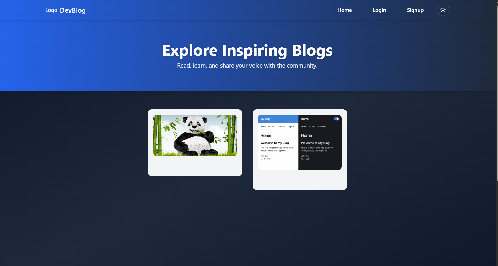
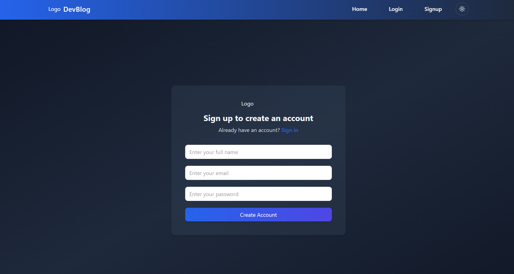
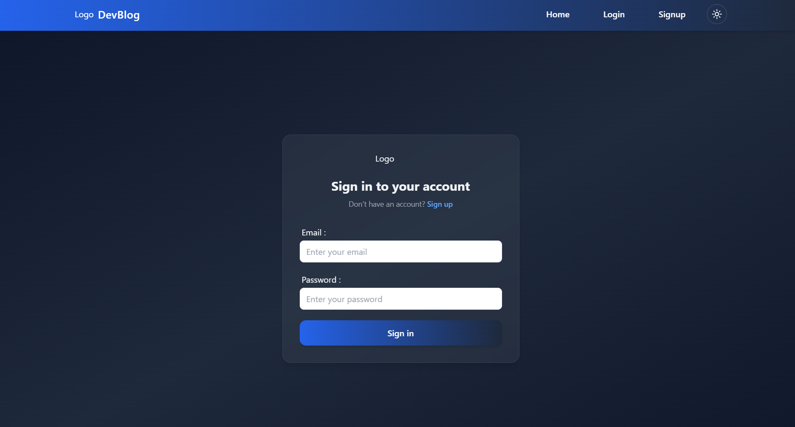
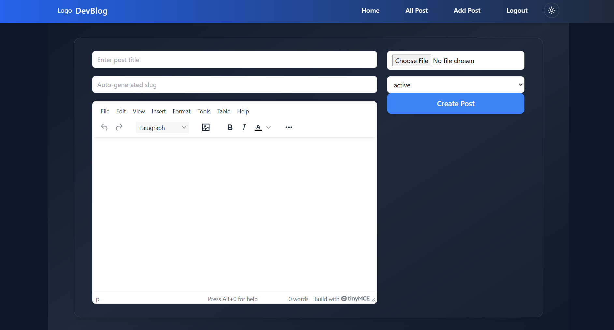
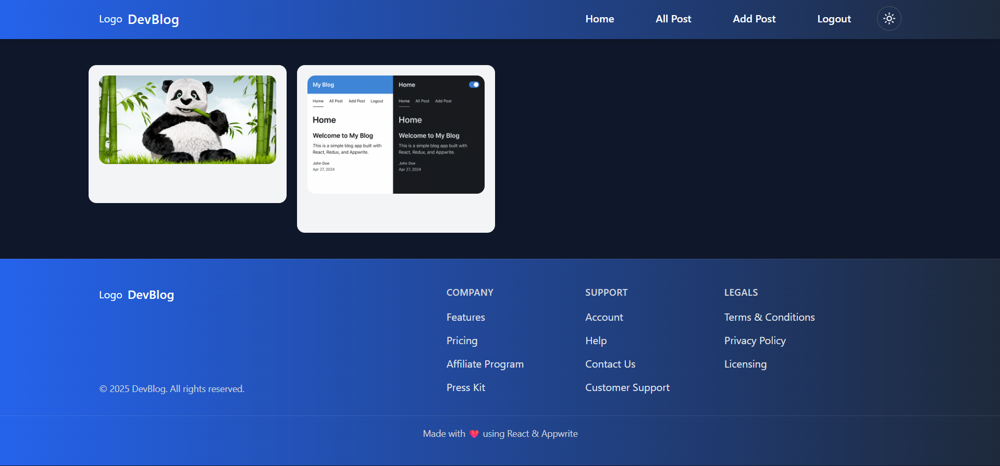

# Blog App 📝


A modern **blog application** where users can create, manage, and share blog posts. Features include authentication, a rich text editor, and **light/dark theme modes**.

---

## 🚀 Features

- ✅ **User authentication:** Signup, Login, Logout  
- ✅ **View all posts** on the home page  
- ✅ **Add, edit, and delete posts** with a rich text editor  
- ✅ **Light & Dark theme mode** toggle  
- ✅ **Responsive design** for all devices  

---

## 🛠 Tech Stack

- **Frontend:** React, Redux Toolkit, Tailwind CSS  
- **Routing:** React Router DOM  
- **Editor:** TinyMCE React  
- **Backend:** Appwrite (authentication & database)  


## 💻 Installation

1. Clone the repository:

```bash
git clone https://github.com/Harshitasinghbisht/Blog-app.git


```
## 2. Navigate into the project folder:
      cd Blog-app

## 3. Install dependencies:
```
   npm install

```
## 4. Start the development server:
      npm run dev

## 5. Open in your browser:
```
   http://localhost:5173

 ```
## 📂 Project Structure**
  - **appwrite/**      # Appwrite API & backend integration
  - **components/**    # Reusable UI components
  - **pages/**         # Home, Login, Signup, AddPost, AllPosts
  - **conf/**          # Configuration files
  - **store/**         # Redux store & slices
    

### 📷 Screenshots

### Home Page: Dark Mode/Light Mode



### Login Page


### Sign In


### Add Post Page


### All Posts

